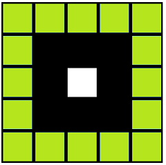
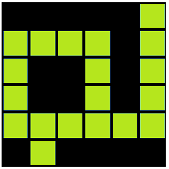
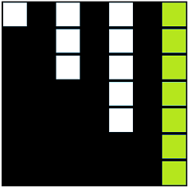
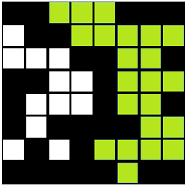

# Tudy cesta nevede?
Dá se bludištěm projít? Vaším úkolem bude zjistit zda lze bludištěm projít shora dolů. 
Avšak jeho tvůrce byl poněkud roztržitý a tak bludiště může být značně velké a nepřehledné. 

Může mít 0 a více vstupů a stejně tak 0 a více výstupů, může obsahovat řadu slepých uliček 
a dokonce i cesty nevedoucí odnikud nikam.

Cesty se mohou vzájemně spojovat a tak mohou např. nastat situace kdy několik cest ze vstupu vede do stejného výstupu 
nebo několik cest se spojí a nakonec nevedou k žádnému výstupu, ... 
 
Bludiště může vypadat například takto:
 

## Další omezení
Testováná bludiště budou vždy jen čtvercová.

Omezíme se pouze na vertikální průchod.
Nezajímají nás vstupy/výstupy po stránach, tedy cesty z leva do prava ani spojení z levá/pravá do nahoře/dole.

V bludišti se lze pohybovat pouze pravoúhelně ve směru os x a y.

# Implementace
Bludiště je reprezentováno maticí booleovských hodnot, kde
* **true** označuje bod na nějaké cestě
* **false** označuje zeď

**Doplňte vaši implementaci do třídy [YourMazeSolver](maze-assignment/src/main/java/net/homecredit/jobsdev/YourMazeSolver.java).**

# Příklady
Níže naleznete několik příkladů jednoduchých bludišť použitých v unit testech. Všimněte si, že cesty rozhodně nemusí být optimální.

Legenda:
*  - cesta vede skrz
*  - cesta nevede skrz 
*  - zeď

 

V projektu naleznete 3 sady testovacích instancí:
1. [YourMazeSolverTest1](maze-assignment/src/test/java/net/homecredit/jobsdev/YourMazeSolverTest1.java) - základní, triviální a hraniční případy 
2. [YourMazeSolverTest2](maze-assignment/src/test/java/net/homecredit/jobsdev/YourMazeSolverTest2.java) - reálně vypadající, přesto stále malá bludiště
3. [YourMazeSolverTest3](maze-assignment/src/test/java/net/homecredit/jobsdev/YourMazeSolverTest3.java) - velké náhodně vygenerované instance, načítané ze souboru [test_instances.zip](maze-assignment/src/test/resources/test_instances.zip); jejich otestování může trvat řadu minut 
3. [YourMazeSolverTest4](maze-assignment/src/test/java/net/homecredit/jobsdev/YourMazeSolverTest4.java) - velmi velké náhodně vygenerované instance, načítané ze souborů v samostatném repository [EIT-contest/jobsdev-big_test_instances](https://github.com/EIT-contest/jobsdev-big_test_instances); jejich otestování může trvat řadu minut;
 z důvodu velikosti souboru jsou umístěné v samostatné **branch test_instances_ultimate**

# Nápověda
* Jednotlivé cesty či celé bludiště lze chápat různě - jako množinou, matici, či graf.
* Konkrétní tvar ani délka cest není tolik důležitá. Možná stačí jen vědět, že nějaký bod A patří do cesty XYZ.
* Je výhodné přidělit každé nalezené cestě nějaký jednoznačný identifikátor.
* Občas je výhodnější indexovat od 1, klidně např. obětovat první řádek/sloupec a nechat ho nevyužitý.
* Matici bludiště můžete libovolně měnit.
* Testovací nastavení JVM stačí s rezervou na uložení dvou matic 5000 x 5000.
* Není vhodné hned od začátku testovat na největších instancích.

# Odevzdání
Odevzdávejte jeden _.java_ soubor s implementací rozhraní [MazeSolver](maze-assignment/src/main/java/net/homecredit/jobsdev/MazeSolver.java)

Váš **e-mail uveďte v komentáři** kdekoliv v odevzdávaném souboru.

Odevzdat můžete libovolný počet implementací, každá bude otestována a do celkového pořadí bude započítána vždy jen ta nejlepší.

**Odevzdávejte [TADY](http://contest.embedit.cz:8080)**  (v případě problémů na mail roman.sovka@embedit.cz).

# Vyhodnocení

Každé řešení bude testováno proti sadě vzorových testů a navíc proti další sadě testů, které budou stejného typu a velikosti jako vzorové testy.
Test bude proveden vždy spuštěním `mvn clean install` s totožným nastavením `pom.xml`, výsledky pro ohodnocení poskytne JUnit report.
Doba běhu bude omezena na 30 minut.

Součet počtu úspěšných testů a časů pak dá celkové skóre Vaší implementace.

Celkové pořadí bude určeno podle počtu úspěšných unit testů a v případě shody podle nejkratšího dosaženého času.

O výsledném pořadí včetně výherců budete informování e-mailem.

# Výhry

**1. místo - 50 000 Kč** 

**2. místo - 30 000 Kč**
 
**3. místo - 20 000 Kč**
